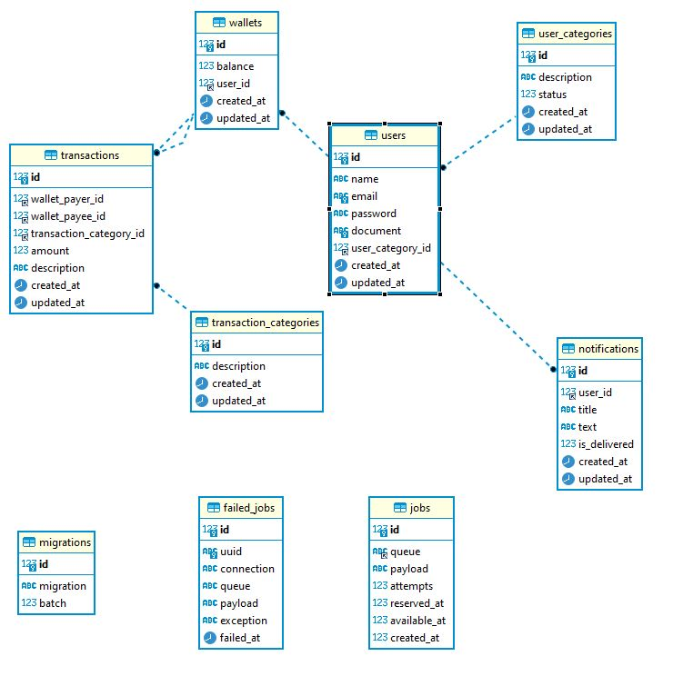

# Projeto PP - Api Restful using Lumen Microframework

## Used technologies

1. [Lumen](https://lumen.laravel.com/docs/9.x) - Microframework Version 9.x 
2. PHP >= 8.0
3. MySQL 8.0
4. Docker
5. docker-compose


## Configuration 

Optional configuration: Install Make

### Linux
```
sudo apt-get install make
```
### Windows
[Install make on Windows](https://stackoverflow.com/questions/32127524/how-to-install-and-use-make-in-windows)


## Runnig the project
```
user@user:~$ git clone 
user@user:~$ cp .env.example .env 
user@user:~$ make up //docker-compose up
user@user:~$ make migrate //docker exec -it api-php  php /app/artisan migrate:fresh --seed 
```
## Api Documentation
For a better understanding of the project endpoints, you can check the docs : http://localhost:8000/doc/index.html


## Architecture

The microframework is based on the [Laravel](https://laravel.com/) framework, so the architecture is similar. 

A router is used to define the endpoints, and the controllers are used to handle the requests.

The application is divided basically in 4 parts: Controllers, Services, Repositories and Models.

The Service repository pattern is used to abstract the logic of the application, keeping the controllers clean and simple.


## Migrations

Migrations are used to create the database tables and to update them.
The command bellow will create the tables and the seeders:

```
user@user:~$ make migrate //docker exec -it api-php  php /app/artisan 
```

## Authentication

The project is protected with JWT, so the user must be authenticated to access the transaction endpoint.

## Notifications Queue

Another important feature of the project is the [Notifications Queue](https://laravel.com/docs/queues#notifications).

At the success of a transaction a simulation of notification is sent to the user's email.

So the complete transaction notifications are sent to the queue, and a Job is responsible for handling the notifications. 

If the external service is not available, the notification is sent to the queue again. This is a simple mechanism to avoid the missing notifications.

The worker have to be running in the background, to process the queue, otherwise the notifications will be in the queue forever.

```
user@user:~$ make queue //docker-compose exec api-php php /app/artisan queue:work
```

## Tests

In this project the tests were created using the PHPUnit framework. 
Use the command bellow to run the unit and integration tests:

```
user@user:~$ make migrate //docker exec -it api-php  php /app/artisan 
user@user:~$ make test //docker exec -it api-php ./vendor/bin/phpunit
```

## DataBase

The picture below shows the database Diagram.




Observe that the Jobs Table are created in the database by the php artisan command, and are necessary to process the queue.

## Another Features

### Apidoc

The project use Apidoc to generate the documentation.

```
npm install apidoc -g
```

### Adminer - Mysql

The docker-compose file contains the adminer container, which is a mysql manager.

http://localhost:8080


### Another useful make commands
```
make build //build the containers
make up // start the containers
make stop // stop the containers
make bash //  open a bash in the container api-php
```


